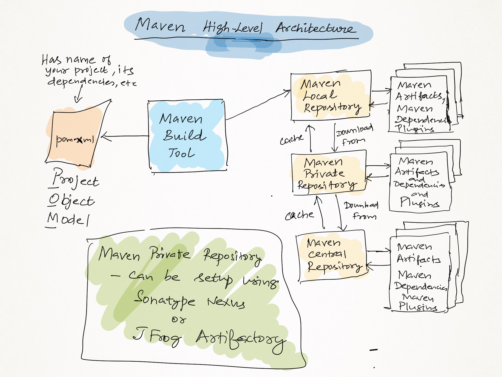
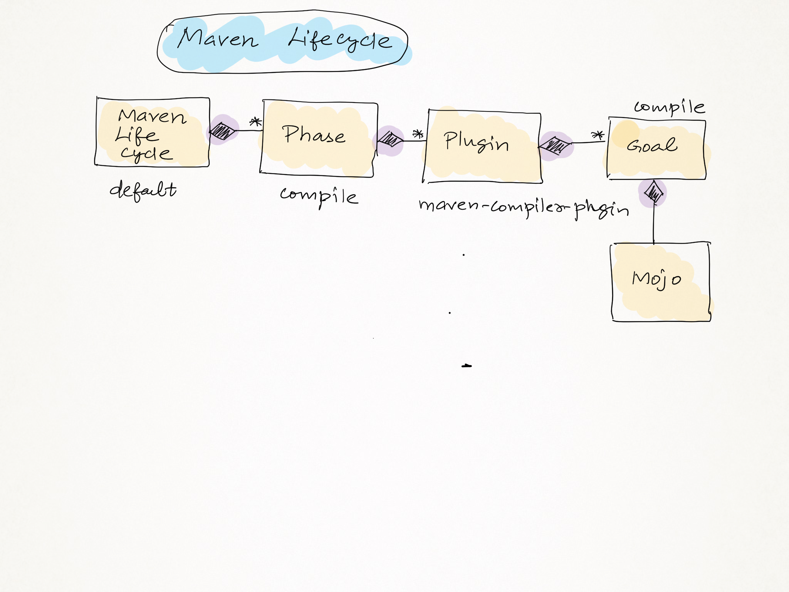

### For consulting/training requirements you may reach me - jegan@tektutor.org

# Maven Overview
-  is an Opensource build tool from Apache Foundation
-  is an alternate to Apache Ant, Gradle, etc
-  supports dependency management
-  is an technology agnostic build tool
   - by default works as a build tool for Java based projects
   - however, can be customized to support Python,C#, Scala,C/C++, etc programming languages
-  everything in Maven are named in terms of Maven coordinates
   -  groupId (Reverse domain name of your organization - eg: org.tektutor)
   -  artifactId (name of jar,war,ear,zip, etc)
   -  version (version of your jar,war,ear,etc)
- support 3 types of repositories
  - local repository ( can be located at User Home directory .m2 folder in Windows/Unix/Linux/Mac )
  - private repository ( can be setup using Sonatype Nexus or JFrog Artifactory, etc )
  - central repository ( http://search.maven.org - for open source third party libraries/plugins )
-  supports convention over configuration
   - if we follow Maven conventions, we can use most of the Maven features without much configurations
   - in case of legacy projects or for other reasons if you can't follow Maven recommended directory structure then
     maven allows configuring pom.xml, settings.xml to override its defaut behaviour

## Maven high level architecture


# Commonly used Apache Maven commands

### Checking maven version
```
mvn --version
```

### Maven Lifecycle


### Listing Maven default life-cycle phases
```
mvn help:describe -Dcmd=compile
mvn help:describe -Dcmd=validate
mvn help:describe -Dcmd=test
```

Any one of the above commands will list the Maven default life-cycle phases.  
You may substitute any phase that you remember in the default lifecycle.

### Listing Maven clean life-cycle phases
```
mvn help:describe -Dcmd=clean
```

### Listing Maven site life-cycle phases
```
mvn help:describe -Dcmd=site
```

### Finding the goals supported by a plugin
```
mvn help:describe -Dplugin=org.apache.maven.plugins:maven-compiler-plugin:3.1 -Ddetail
```

### Just compile all the files in src/main/java and its sub-directories
```
mvn compile
```

### Compile application and execute automated test cases 
```
mvn test
```

### Deleting target folder
```
mvn clean
mvn pre-clean
mvn post-clean
```
Any one of the above commands will list clean life-cycle phases.

### Creating jar/war/ear depending on the Maven project type
```
mvn package
```

### Installing the artifacts(jar,war,ear) into Maven local repository(.m2 folder)
```
mvn install
```

### Deploying maven artifacts(jar,war,ear,etc) into Sonatype Nexus/JFrog Artifactory or Weblogic/Websphre/Tomcat etc.,
```
mvn deploy
```

This requires adding distributionManagement tag in pom.xml file
```
<distributionManagement>
     <repository>
          <id>artifactory</id>
          <url>http://localhost:8081/artifctory/tektutor</url>
     </repository>
</distributionManagement>
```

You also need to provide the artifactory credential in settings.xml file
```
<servers>
   <server>
       <id>artifactory>
       <username>admin</username>
       <password>Admin@123</password>
   </server>
</servers>
```

### Enabling build debug info(verbosity)
```
mvn clean deploy -X
```
The -X switch helps in troubleshooting issues by enabling verbosity. This can be used with any maven command.

